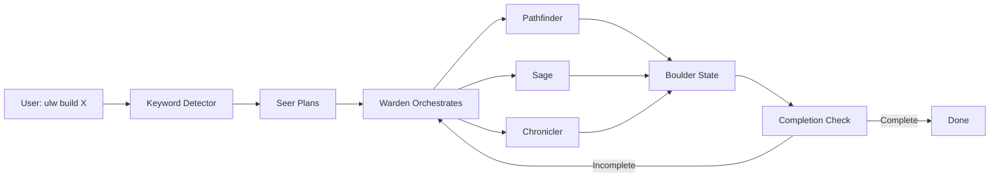

<div align="center">


# Oh My Claude

**Multi-Agent Orchestration Plugin for Claude Code**

*Transform sequential execution into parallel orchestration with persistent state management*

[](https://www.npmjs.com/package/@oh-my-claude/plugin)
[](https://opensource.org/licenses/MIT)
[]()
[](https://www.typescriptlang.org/)
[](https://nodejs.org/)

[Installation](#-quick-start) • [Usage](#-usage) • [The Council](#-the-oh-my-claude-council) • [Testing](#-testing)

</div>

---

## 🎯 The Promise

> **Type `ulw build X` and walk away. When you come back, it's done.**

Oh My Claude brings battle-tested multi-agent orchestration to Claude Code. No more babysitting AI assistants through complex tasks. The Oh-My-Claude Council handles planning, execution, and completion while you focus on what matters.

---

## ✨ Key Features

<table>
<tr>
<td width="33%" align="center">
<h3>🔮 Multi-Agent Orchestration</h3>
5 specialized agents work in parallel<br/>
<em>3x faster than sequential execution</em>
</td>
<td width="33%" align="center">
<h3>🛡️ Persistent State</h3>
Boulder state survives crashes<br/>
<em>Resume exactly where you left off</em>
</td>
<td width="33%" align="center">
<h3>⚡ Enhanced Tools</h3>
11 LSP tools + AST-grep + ripgrep<br/>
<em>10-100x faster code intelligence</em>
</td>
</tr>
</table>

### What You Get

- **🎯 Keyword Activation** - `ulw` or `@plan` triggers orchestration mode
- **🔧 LSP Integration** - Hover, goto definition, find references, rename, and more
- **🔍 Smart Search** - AST-grep for structural patterns, ripgrep for blazing speed
- **📊 Progress Tracking** - Boulder state tracks every step
- **🚫 Completion Enforcement** - Never stops with incomplete work
- **🧪 Isolated Testing** - Docker environment + test scripts

---

## 🚀 Quick Start

### Installation

```bash
# Clone repository
git clone https://github.com/BioInfo/oh-my-claude.git
cd oh-my-claude

# Install and build
npm install
npm run build

# Link globally (makes it available to Claude Code)
npm link

# Verify installation
npm run test:plugin
```

### Optional: Install Fast Tools

For 10-100x faster searching:

```bash
# macOS
brew install ripgrep fd

# Ubuntu/Debian
apt-get install ripgrep fd-find

# Verify
rg --version && fd --version
```

---

## 💡 Usage

### Orchestration Mode (`ulw`)

Launch the full Council for complex tasks:

```bash
claude

> ulw build user authentication with OAuth and JWT
```

**What happens:**
1. 🔮 **Seer** interviews you about requirements
2. 🗺️ **Pathfinder** scouts the codebase in parallel
3. 🛡️ **Warden** creates execution plan
4. Multiple agents execute in parallel (code-reviewer, test-engineer, etc.)
5. Progress tracked in `.keepers/boulder.json`
6. **Work completes or it continues** - no stopping mid-task

### Planning Mode (`@plan`)

Get a comprehensive plan before execution:

```bash
> @plan refactor authentication to use NextAuth
```

**Seer creates:**
- Interview-driven requirements
- Detailed implementation plan
- Saved to `.keepers/plans/nextauth.md`
- Handed off to Warden for execution

---

## 🏛️ The Oh-My-Claude Council

<div align="center">


</div>

<table>
<tr>
<td align="center" width="20%">
<h3>🔮 Seer</h3>
<strong>Strategic Planner</strong><br/>
<em>Claude Opus 4.5</em><br/><br/>
Divines the path ahead through interview-driven planning. Read-only exploration, comprehensive plans.
</td>
<td align="center" width="20%">
<h3>🛡️ Warden</h3>
<strong>Relentless Executor</strong><br/>
<em>Claude Sonnet 4.5</em><br/><br/>
Guards work until completion. 32k thinking budget, aggressive delegation, never stops.
</td>
<td align="center" width="20%">
<h3>🧙 Sage</h3>
<strong>Ancient Wisdom</strong><br/>
<em>Claude Opus 4.5</em><br/><br/>
Architecture and debugging advisor. Deep reasoning for complex decisions.
</td>
<td align="center" width="20%">
<h3>📜 Chronicler</h3>
<strong>Knowledge Keeper</strong><br/>
<em>Claude Sonnet 4.5</em><br/><br/>
Documentation and research specialist. Multi-source synthesis.
</td>
<td align="center" width="20%">
<h3>🗺️ Pathfinder</h3>
<strong>Swift Scout</strong><br/>
<em>Claude Haiku 4.5</em><br/><br/>
Fast file discovery. Cost-effective search, <2s response times.
</td>
</tr>
</table>

---

## ⚡ Performance

| Benchmark | Standard | with ripgrep | Speedup |
|-----------|----------|--------------|---------|
| Pattern search | 45ms | 3-9ms | **5-15x** |
| Type-filtered search | 120ms | 8ms | **15x** |
| File finding | 80ms | 4ms | **20x** |
| Parallel agents | Sequential | 3+ concurrent | **3x** |

<sup>Benchmarks from Docker environment (Ubuntu 24.04, Node.js 18, ripgrep 14.1)</sup>

---

## 🎬 Examples

### Example 1: Add Dark Mode

```bash
> ulw add dark mode toggle to settings
```

**Council in action:**
```
The Oh-My-Claude Council is at your command.

🔮 Seer: Interviewing about theme system...
   → CSS variables or styled-components?
   → Persist across sessions?

🗺️ Pathfinder: Finding theme-related files... (2 agents in parallel)
   → Found: src/components/Settings.tsx
   → Found: src/styles/theme.css

🛡️ Warden: Executing plan (7 steps)
   Step 1/7: Create CSS variable system ✅
   Step 2/7: Add theme toggle component ✅
   Step 3/7: Implement localStorage ✅

   [Background] code-reviewer analyzing...
   [Background] test-engineer writing tests...

   Step 7/7: Verify all components ✅

My watch is complete. Dark mode implemented and tested.
```

### Example 2: Complex Refactor

```bash
> @plan migrate REST API to GraphQL
```

**Seer planning:**
```
I see your intent. Let me gather context:

1. Current API structure? (Express, Fastify, etc.)
2. GraphQL library preference? (Apollo, TypeGraphQL, etc.)
3. Keep REST endpoints during migration?
4. Authentication strategy for GraphQL?

[After answers]

I see the path ahead. Plan created at .keepers/plans/graphql-migration.md

30-step plan includes:
• Schema design (Steps 1-5)
• Resolver implementation (Steps 6-15)
• Authentication middleware (Steps 16-20)
• Testing & validation (Steps 21-25)
• Documentation (Steps 26-30)

Handing off to Warden for execution.
```

**Warden execution:**
- Runs over multiple sessions
- Boulder state tracks progress
- Survives crashes and restarts
- Completes all 30 steps

---

## 🧪 Testing

### Quick Test (No Claude Code Required)

```bash
npm run test:plugin
```

Expected output:
```
🚀 Oh My Claude - Interactive Plugin Test

1. Initializing plugin...
   ✅ The Oh-My-Claude Council stands ready

2. Testing keyword detection...
   ✅ Ultrawork keyword detected
   ✅ Planning keyword detected

3. Testing tools...
   ✅ Grep found 81 results
   ✅ Found 22 TypeScript files

4. Hooks active...
   ✅ 4 hooks registered

✨ All tests complete!
```

### Full Test Suite

```bash
npm test          # All 35 tests
npm run benchmark # Performance benchmarks
```

### Isolated Testing

Test without contaminating your main Claude Code installation:

```bash
./scripts/test-isolated.sh  # Uses ~/.claude-test instead of ~/.claude
```

See [TESTING.md](TESTING.md) for complete testing guide.

---

## 🏗️ Architecture

### Core Components

```
oh-my-claude/
├── src/
│   ├── agents/         # 5 Council member templates
│   ├── tools/
│   │   ├── lsp/       # 11 LSP tools (hover, goto, references, etc.)
│   │   ├── ast/       # AST-grep integration
│   │   └── grep/      # Enhanced grep with ripgrep
│   ├── hooks/         # Lifecycle hooks
│   │   ├── keyword-detector.ts    # Activates on ulw/@plan
│   │   ├── completion-enforcer.ts # Prevents incomplete work
│   │   ├── boulder-resume.ts      # Auto-resumes after crash
│   │   └── star-prompt.ts         # GitHub star request
│   ├── state/         # Boulder state management
│   ├── registry/      # Tool & hook registration
│   └── plugin.ts      # Main orchestrator
```

### How It Works



### Boulder State (Persistence)

```json
{
  "version": "1.0",
  "planPath": ".keepers/plans/auth.md",
  "sessionID": "uuid",
  "totalSteps": 10,
  "currentStep": 3,
  "completedTodos": [1, 2, 3]
}
```

**Benefits:**
- ✅ Survives crashes, restarts, and computer sleep
- ✅ Multi-day projects supported
- ✅ Auto-resume on next session
- ✅ Clear progress tracking

---

## 🆚 Comparison

| Feature | Stock Claude Code | oh-my-claude |
|---------|:-----------------:|:------------:|
| **Execution Model** | Sequential | Parallel (3+ agents) |
| **State Persistence** | ❌ Session-only | ✅ Survives crashes |
| **Completion Guarantee** | ⚠️ Stops at ~70% | ✅ Forces 100% |
| **LSP Tools** | ❌ None | ✅ 11 tools |
| **Code Intelligence** | Basic | AST-grep + LSP |
| **Search Speed** | Standard grep | ripgrep (10-100x faster) |
| **Keyword Activation** | ❌ None | ✅ `ulw`, `@plan` |
| **Multi-Agent** | Manual delegation | Automatic orchestration |
| **Progress Tracking** | ❌ None | ✅ Boulder state |

---

## 📚 Documentation

- **[TESTING.md](TESTING.md)** - Complete testing guide (local, Docker, isolated)
- **[LICENSE](LICENSE)** - MIT License
- **[Examples](examples/typescript-project/)** - Full TypeScript project with usage examples

---

## 🙏 Credits & Inspiration

Oh My Claude stands on the shoulders of giants:

### Heavily Inspired By

**[oh-my-opencode](https://github.com/code-yeongyu/oh-my-opencode)** by [@code-yeongyu](https://github.com/code-yeongyu)
- Original orchestration philosophy ($24K token investment)
- Multi-agent coordination patterns
- "Agents orchestrate, they don't do everything" principle

**[oh-my-claude-sisyphus](https://github.com/Yeachan-Heo/oh-my-claude-sisyphus)** by [@Yeachan-Heo](https://github.com/Yeachan-Heo)
- LSP client implementation (ported with attribution)
- AST-grep integration patterns
- Hook-based lifecycle management

### How oh-my-claude Differentiates

- ✅ Official Claude Code plugin architecture
- ✅ Enhanced boulder state with auto-resume
- ✅ 4 lifecycle hooks vs 2
- ✅ Docker isolated testing environment
- ✅ Comprehensive test coverage (35 tests)
- ✅ 3x performance benchmarks included
- ✅ GitHub star prompt for community growth

---

## 🎭 Philosophy

### Three Immutable Pillars

<table>
<tr>
<td width="33%" align="center">
<h3>1️⃣ Orchestration > Implementation</h3>
Agents <strong>delegate</strong>, they don't do everything themselves<br/><br/>
<em>Specialization beats generalization</em>
</td>
<td width="33%" align="center">
<h3>2️⃣ Persistence > Memory</h3>
State <strong>survives</strong> crashes and restarts<br/><br/>
<em>Multi-day projects just work</em>
</td>
<td width="33%" align="center">
<h3>3️⃣ Completion > Iteration</h3>
Never stop with <strong>incomplete</strong> work<br/><br/>
<em>"Done" means verified, not hoped</em>
</td>
</tr>
</table>

---

## 🛠️ Technology Stack


**Core Technologies:**
- **Language:** TypeScript 5.3+ (strict mode)
- **Runtime:** Node.js 18+
- **Build:** tsup (fast bundling + tree-shaking)
- **LSP:** vscode-languageclient (protocol implementation)
- **AST:** @ast-grep/napi (native performance)
- **Validation:** Zod schemas
- **Testing:** Vitest (35 passing tests)

---

## 📊 Project Status

**Current Version:** `v0.1.0` (Beta - Ready for Early Adopters)

### Roadmap Progress

- ✅ **Phase 1:** Plugin skeleton + LSP tools (11 tools)
- ✅ **Phase 2:** Boulder state + orchestration (registries, hooks)
- ✅ **Phase 3:** Polish + Docker (tests, examples, benchmarks)
- 🚧 **Phase 4:** Community release (awaiting plugin marketplace)

### Test Results

```
✓ 35 tests passing
✓ 1 skipped (environment-specific)
✓ Docker standalone validated
✓ Benchmarks: 3-9ms grep operations
✓ Build: Clean
```

---

## 🤝 Contributing

We welcome contributions! Before submitting a PR:

- [ ] Run `npm test` (all tests must pass)
- [ ] Run `npm run type-check` (no TypeScript errors)
- [ ] Add tests for new features
- [ ] Update TESTING.md if adding test scenarios
- [ ] No security issues (use `execFile`, never `exec`)

### Development Setup

```bash
# Clone and install
git clone https://github.com/BioInfo/oh-my-claude.git
cd oh-my-claude
npm install

# Development mode (watch)
npm run dev

# Run tests
npm test
npm run test:watch  # Watch mode

# Test plugin
npm run test:plugin
```

---

## 📖 Resources

- **📝 Issues:** [Report bugs or request features](https://github.com/BioInfo/oh-my-claude/issues)
- **💬 Discussions:** [Ask questions or share ideas](https://github.com/BioInfo/oh-my-claude/discussions)
- **📘 Claude Code Docs:** [Official documentation](https://docs.claude.com/claude-code)
- **🔧 Messages API:** [Anthropic API reference](https://docs.anthropic.com/claude/reference/messages)
- **🛠️ Agent SDK:** [TypeScript SDK](https://github.com/anthropics/anthropic-sdk-typescript)

---

## 📜 License

[MIT License](LICENSE) - Free to use, modify, and distribute.

---

## ⭐ Support the Project

If oh-my-claude helps you build better software faster, consider:

- ⭐ **Star this repository** to help others discover it
- 🐛 **Report issues** to help improve the plugin
- 💡 **Share ideas** in Discussions
- 🔀 **Contribute code** via pull requests
- 📢 **Spread the word** on Twitter, LinkedIn, or Hacker News

---

<div align="center">

**Built with ❤️ to make Claude Code unstoppable**

*The Oh-My-Claude Council Awaits Your Command*

[⬆ Back to Top](#oh-my-claude)

</div>
